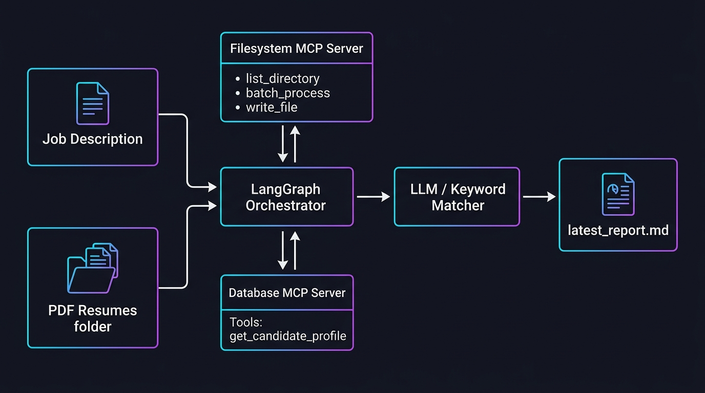

# MCP & LangGraph Resume Matching Pipeline

A modular candidate evaluation and ranking system constructed using the **Model Context Protocol (MCP)** and **LangGraph**. The system integrates a sandboxed filesystem server, an HR metadata database server, and an agentic workflow that parses candidate PDF resumes, queries databases, and ranks candidates against job descriptions.

---

## 1. System Architecture

The project maintains a strict boundary separating the **MCP Server Architecture** from the **Agentic Application Architecture**.



---

## 2. Directory Layout

- **`mcp_servers/`**: Contains standalone MCP servers implementing JSON-RPC 2.0 protocols via `fastmcp`.
  - **[`filesystem_mcp_server.py`](file:///d:/Github/MCP-integration/mcp_servers/filesystem_mcp_server.py)**: Offers sandboxed listing, reading (extracting text from PDF binaries via `pypdf`), parallel file reading (`batch_process`), file writing, and background change tracking (`watch_directory`).
  - **[`db_mcp_server.py`](file:///d:/Github/MCP-integration/mcp_servers/db_mcp_server.py)**: Acts as the HR candidate profile repository offering verification notes, background checks, certifications, and salary expectations.
- **`src/`**: Parent folder for the Agentic application logic.
  - **[`agent/matching_agent.py`](file:///d:/Github/MCP-integration/src/agent/matching_agent.py)**: Orchestrates the LangGraph state machine, connects as a client to both MCP servers via stdio transports, and handles candidate matching.
- **`resumes/`**: Persistent directory containing candidate PDF resumes.
- **`reports/`**: Output directory where final candidate ranking Markdown reports are compiled.
- **[`test_mcp_agent.py`](file:///d:/Github/MCP-integration/test_mcp_agent.py)**: Complete integration test suite running verification checks on all tools, sandbox boundaries, and graph nodes.
- **[`mcp_matching_pipeline.ipynb`](file:///d:/Github/MCP-integration/mcp_matching_pipeline.ipynb)**: Walkthrough notebook explaining the handshake, tool calls, and LangGraph workflow with top-level `await` cells.

---

## 3. Detailed Working Procedure

### A. Initialization & Protocol Handshake
When the pipeline starts, the agent uses subprocess pipelines to spawn both **Filesystem** and **Database** servers via standard input/output streams (`stdio`). Sessions are initialized, and capabilities (tools/resources) are discovered.

### B. Parallel PDF Resume Extraction
The agent calls `list_directory` to discover candidate resumes under `./resumes` ending in `.pdf`. To ingest them efficiently, the agent invokes `batch_process` to read and parse the text content of all resumes concurrently using Python's `ThreadPoolExecutor` and `pypdf` on the Filesystem server.

### C. Multi-MCP Candidate Profile Retrieval
For each candidate resume discovered, the agent extracts the name and queries the **Database MCP Server** via `get_candidate_profile`. This retrieves details (background check pass/fail, expected salary, notes, and certifications) from the HR database.

### D. Grading and Evaluation Engine
Each candidate's profile metadata and resume content is compared against the Job Description.
- If `OPENROUTER_API_KEY` or `OPENAI_API_KEY` is present, evaluations are conducted using LLM completions.
- If keys are missing, the agent falls back to a keyword-matching scoring engine.
Candidates are ranked, and a Markdown evaluation report containing summary tables and breakdowns is saved to `./reports/latest_report.md`.

### E. Sandboxing & Directory Watcher Capabilities
- **Sandbox Bounds**: The Filesystem server evaluates paths against a list of allowed directories. Path traversals (e.g., `../../`) throw permission denials.
- **Directory Watcher**: Calling `watch_directory` monitors folder states. The polling watcher detects newly copied files, returning updates since the previous check.

---

## 4. Getting Started & How to Run

### 1. Set Up the Virtual Environment
Initialize a local Python virtual environment to isolate the project packages:
```powershell
python -m venv .venv
```

### 2. Install Dependencies
Activate the environment and install package dependencies listed in `requirements.txt`:
```powershell
# On Windows (PowerShell)
.venv\Scripts\pip install -r requirements.txt
```

### 3. Environment Variables
Create a file named `.env` in the root directory (based on `.env` template):
```env
OPENROUTER_API_KEY=your_key_here
OPENROUTER_MODEL=google/gemini-2.5-flash
```
*Note: If no keys are provided, the system gracefully falls back to the keyword matching evaluation.*

### 4. Running the Automated Test Suite
Ensure that candidate PDF resumes are present in the `./resumes` folder (the system reads them directly as persistent data). Run the modular test script:
```powershell
.venv\Scripts\python.exe test_mcp_agent.py
```

### 5. Running the Jupyter Notebook Walkthrough
To interactively execute and observe each pipeline node:
```powershell
.venv\Scripts\jupyter notebook mcp_matching_pipeline.ipynb
```
Once Jupyter opens, open the notebook and execute all cells sequentially.

---

## 5. Security & Verification
The integration test suite **[`test_mcp_agent.py`](file:///d:/Github/MCP-integration/test_mcp_agent.py)** runs 9 testing scenarios:
1. List available tools on all active MCP servers.
2. List available resource endpoints (`resumes://list`, `reports://latest`, etc.).
3. Direct validation of the sandboxed `list_directory` tool.
4. Parsing of individual PDF resume text contents.
5. Large PDF layout reading checks.
6. Parallel batch parsing of files using `batch_process`.
7. Polling changes in directories dynamically using `watch_directory`.
8. Querying HR database metadata on candidate profiles.
9. Validating folder boundary sandboxing checks against path traversals.
